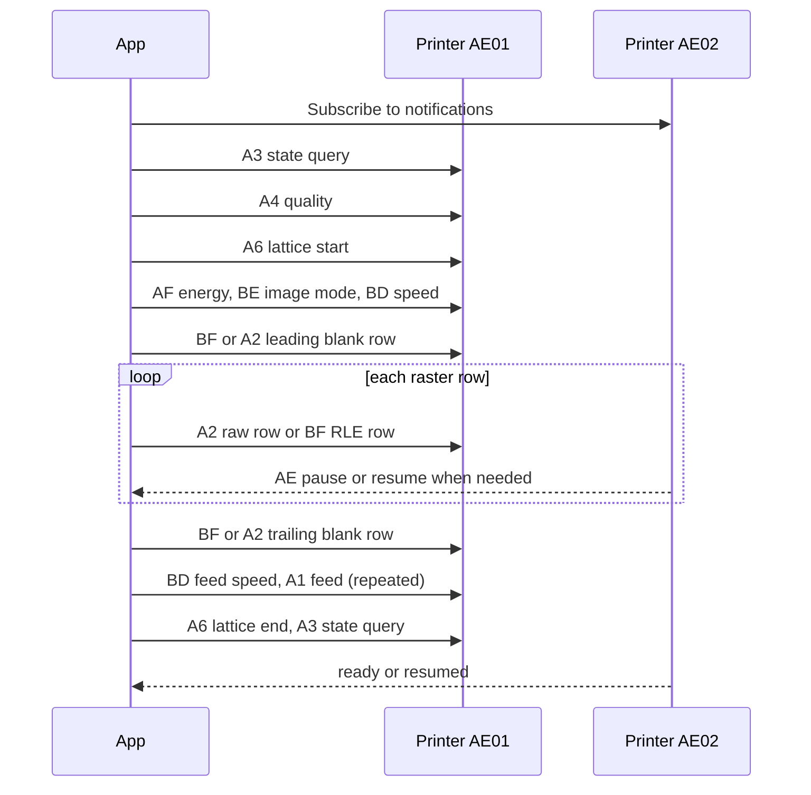

# Cat printer protocol reference

## Purpose

This reference describes Bluetooth messages and observed firmware behavior for cat printers. It covers the common `51 78` family and the MXW01 `22 21` family.

This is not a vendor specification. "Cat printer" is a product category, not one hardware model. Identical names and cases can contain incompatible electronics.

Behavior depends on the model and firmware. Tentative meanings and unknown fields are identified where they occur.

## What "the `51 78` BLE protocol" means

The phrase names a proprietary application protocol carried over Bluetooth Low Energy (BLE). It is not part of the Bluetooth standard.

`51 78` means the two literal bytes `0x51 0x78`. They form the preamble, or magic value, at the start of each common-family frame.

| Layer | Example | Meaning |
| --- | --- | --- |
| printer command frame | `51 78 ... FF` | proprietary application layer |
| GATT operation | `write AE01` | Bluetooth data model |
| ATT packet | `Write Command` | Bluetooth attribute transport |
| LE connection | `packets/radio` | Bluetooth link |

BLE transports byte strings between characteristic values. The printer firmware assigns meaning to those bytes through the `51 78` frame grammar.

### BLE terms used here

| Term | Meaning |
| --- | --- |
| central / peripheral | The host initiates the connection as central. The printer normally acts as peripheral. |
| client / server | GATT roles. The host is usually the client and the printer is the server. These roles are separate from link roles. |
| GATT | Generic Attribute Profile. It organizes data as services, characteristics, and descriptors. |
| ATT | Attribute Protocol. It carries GATT reads, writes, notifications, and indications. |
| service | A UUID-named group of related characteristics. `AE30` is the common print service. |
| characteristic | A UUID-named byte value plus allowed operations. It resembles a typed endpoint, not a socket port. |
| UUID | A 128-bit identifier for a service, characteristic, or descriptor. Short values expand into the Bluetooth base UUID. |
| property | An advertised operation such as Read, Write, Write Without Response, Notify, or Indicate. |
| advertising | Connectionless announcements before connection. They contain identity and optional service hints. |
| service discovery | Reading the actual GATT database after connection. Advertising hints and discovered services can differ. |
| ATT MTU | Maximum ATT packet size. A normal Write Command carries at most `ATT_MTU - 3` value bytes. |
| Write Without Response | An ATT Write Command with no ATT reply, error, or backpressure signal. |
| notification | A peripheral-to-central value update with no ATT confirmation. |
| indication | A value update that requires ATT confirmation. |
| CCCD | Descriptor `0x2902`. A GATT client writes it to enable notifications or indications. |
| application frame | A printer message such as `51 78 … FF`. Its grammar is separate from ATT packet boundaries. |

BLE and ATT define the transport behavior. \[[Bluetooth LE primer][bluetooth-primer]\] \[[ATT specification][bluetooth-att]\]

### Notation

| Form | Meaning |
| --- | --- |
| `51 78` | Two hexadecimal bytes, `0x51` followed by `0x78`. It is not the ASCII text `"51 78"`. |
| `u16le` | Unsigned 16-bit integer with the least-significant byte first. |
| 1-bpp / 4-bpp | One or four bits per pixel. |
| dot | One physical heating element across the print head. |
| row or scanline | One horizontal line of dot values. |
| payload | Command-specific bytes inside an application frame. |
| raster | An image represented as rows of pixel values. |
| RLE | Run-length encoding: repeated pixels stored as color and count. |
| LSB-first | The leftmost pixel uses the least-significant bit. |
| nibble | Four bits, or half a byte. |
| CRC | Cyclic redundancy check: a value for error detection. |
| LZO | A lossless compression format, used here for raster data. |

## Protocol families

Protocol families differ in frame format, command meaning, and data channel. A matching name or GATT service does not identify the family.

| Family | Preamble | Main data path | Examples |
| --- | ---: | --- | --- |
| Common or "Tiny" | `51 78` | commands and rows on `AE01` | GB01–GB05, GT01, some PD01 and MX profiles |
| Tiny with prefixed start | `12 51 78` for the initial `A3` | later commands use `51 78` on `AE01` | GB03, JXM800, LY10, LY11, LP100 |
| Extended `51 78` or "V5G" | `51 78` | commands and rows on `AE01` | some MX, YT, and PD01 profiles |
| MXW01 or "V5X" | `22 21` | control on `AE01`, raster on `AE03` | MXW01 and some look-alike profiles |
| Other families | varies | varies | ESC/POS, TSPL, Bluetooth Classic, and other BLE printers |

"Tiny," "V5G," and "V5X" are informal names for protocol variants. Model names alone do not establish compatibility. \[[TiMini models][timini-models]\]

The initial `12` prefix is model-dependent. Its requirement for a given GB03, JXM800, LY10, LY11, or LP100 unit remains uncertain. \[[NaitLee driver][naitlee-driver]\] \[[TiMini profiles][timini-profiles]\]

Some printers use Bluetooth Classic Serial Port Profile instead of BLE GATT. \[[TiMini profiles][timini-profiles]\]

## Printer names and variants

These names have tentative associations with the variants below. They do not guarantee compatibility for every unit.
The listed formats use 384-dot rows. \[[NaitLee models][naitlee-models]\] \[[TiMini models][timini-models]\] \[[TiMini profiles][timini-profiles]\]

| Advertised name | Protocol variant | Limitations |
| --- | --- | --- |
| `GB01` | common `51 78`, raw `A2` | Energy and pacing depend on the unit. |
| `GB02` | common `51 78`, raw `A2` | Feed and energy controls can have no effect. \[[GB02 compatibility][rbaron-gb02]\] \[[GB02 controls][rbaron-gb02-controls]\] |
| `GB03` | Tiny, raw `A2` or RLE | Initial `12` prefix requirement remains uncertain. |
| `GB05` | Tiny RLE | Hardware compatibility remains unconfirmed. |
| `GT01` | common `51 78`, raw `A2` and RLE | Example job below applies to one firmware variant. \[[GT01 capture][lisp-readme]\] |
| `MX05`, `MX06`, `MX08`–`MX11` | basic `51 78`, V5G, or V5X | Family and feed behavior depend on the unit. \[[MX10 behavior][cataclysm]\] |
| `YT01` | basic `51 78`, V5G, or V5X | MAC suffix `59` is a tentative V5X indicator. |
| `PD01` | basic `51 78`, V5G, or V5X | Firmware variants use different job formats. \[[PD01 protocol][pd01]\] |
| `SC03h` | Tiny RLE | Hardware compatibility remains unconfirmed. |
| `MXTP*` | basic `51 78`, V5G, or V5X | `MXTP-100` with MAC suffix `59` is a tentative V5X association. |
| `X6h` / `X6H` | Tiny RLE or extended `51 78` with `CE` and `CF` LZO | Extended behavior is established for one X6h unit only. \[[X6h protocol][x6h]\] |
| `MXW01` | `22 21` control plus `AE03` raster | Incompatible with common `51 78` jobs. \[[MXW01 protocol][mxw01]\] |

### Identification limits

A matching name or service UUID does not establish protocol compatibility.
GATT discovery does not reveal raster encoding, command order, energy byte order, or completion behavior.
No reliable capability-negotiation command is documented.

Use the advertised name, manufacturer data, address, and discovered services together to identify a variant.
Names can contain a model prefix and a suffix. For example, `MXTP-100` includes the prefix `MXTP`.
Name matching can be case-sensitive. `X6h` and `X6H` do not guarantee the same firmware. \[[NaitLee models][naitlee-models]\] \[[TiMini models][timini-models]\]

BLE privacy can rotate addresses, and some platforms expose device identifiers instead of MAC addresses.
A MAC suffix is therefore only an identification hint.

If the family remains uncertain, establish compatibility before sending commands. Do not probe unknown commands automatically.

## BLE transport

### Discovery

Printers can advertise names such as `GT01`, `GB02`, `GB03`, `MX10`, or `PD01`.
The advertised name does not describe the GATT services or characteristic properties.

The following GATT layout applies to GT01. Other devices can omit entries. \[[GT01 capture][lisp-readme]\]

| UUID suffix | Property | Known use |
| --- | --- | --- |
| Service `AE30` | primary service | normal printing |
| `AE01` | Write Without Response | host commands and raster rows |
| `AE02` | Notify | replies, status, and flow control |
| `AE03` | Write Without Response | MXW01 raster channel. Unknown on common GT01 firmware. |
| `AE04` | Notify | unknown |
| `AE05` | Indicate | unknown |
| `AE10` | Read, Write | unknown |
| Service `AE3A` | primary service | auxiliary service with unknown purpose |
| `AE3B` | Write Without Response | unknown auxiliary input |
| `AE3C` | Notify | unknown auxiliary output |

Use the Bluetooth base UUID for each suffix.
For example, `AE01` expands to `0000ae01-0000-1000-8000-00805f9b34fb`.

Some units advertise `AF30` rather than `AE30`. \[[MX10 advertising][lboue]\]

One MX10 advertising payload is `03 03 30 AF 02 01 06`.
The leading `03 03 30 AF` is a complete list of 16-bit service UUIDs. It contains `AF30` in little-endian order. \[[MX10 advertising][lboue]\]
An advertised service UUID does not establish the complete GATT layout. The relationship between `AF30` advertising and the discovered service remains unresolved.

### Connection rules

Known `AE30` devices receive commands on `AE01` through Write Without Response.
Replies and status arrive on `AE02` after notification subscription through its CCCD.
Enable notifications before sending the first command.
Discover the services after connection. Advertising alone does not establish whether `AE30` or `AF30` contains the print characteristics.

Pairing and bonding are not established protocol requirements. \[[GT01 capture][lisp-readme]\] \[[rbaron BLE][rbaron-ble]\]

Some printers sleep after idle time. Expect disconnects between jobs. A disconnect during a job still leaves its outcome uncertain. \[[MX10 behavior][cataclysm]\]

## Common `51 78` frame

```text
offset  size  field
0       2     preamble: 51 78
2       1     command
3       1     observed type/direction: usually 00 request, 01 response
4       2     payload length, unsigned little-endian
6       N     payload
6+N     1     CRC-8 of the payload only
7+N     1     terminator: FF
```

The practical payload limit is device-specific. Do not infer a safe 65,535-byte payload from the two-byte length field.

Each Write Without Response uses an ATT Write Command. Its boundary is not a `51 78` frame boundary.
One write can contain multiple frames. A frame can also span consecutive writes.

For example, one GT01 ATT Write Command carries `51 78 A8 00 01 00 00 00 FF 51 78 A3 00 01 00 00 00 FF`, which is two complete frames in one operation. \[[GT01 capture][lisp-readme]\]

This byte-stream behavior belongs to the printer protocol. BLE itself does not define printer frame boundaries.

Keep incomplete frames until the remaining bytes arrive.
Before interpreting a frame, make sure that its length, terminator, and CRC are valid.
After an invalid frame, search for the next `51 78` preamble.
Keep a trailing `51` if the next byte has not arrived yet.
The `22 21` family requires a separate frame interpretation.

On one MX10 variant, a malformed `BC` frame declares 513 payload bytes but supplies one.
The printer consumes subsequent commands and raster rows as part of that payload. \[[MX10 behavior][cataclysm]\]

### CRC-8

CRC-8 treats the payload as a polynomial over `GF(2)`, arithmetic with binary coefficients.
Addition and subtraction use XOR, which sets a bit when its inputs differ.

The generator is `g(x) = x^8 + x^2 + x + 1`, written as `0x107`. Code stores only the lower coefficients as `0x07`, because the `x^8` term is implicit.

The initial register is `0x00`. Process each byte most-significant bit first. Do not reflect the input or output, and do not apply a final XOR.

```text
r = 0
for b in payload:
    r = r XOR b
    repeat 8 times:
        if r bit 7 is set: r = ((r << 1) XOR 0x07) AND 0xFF
        else:              r =  (r << 1)           AND 0xFF
return r
```

The frame stores the checksum after the payload. The header, length, and terminator do not enter the calculation. Processing `payload || crc` gives remainder zero.

Test vectors are `00 → 00`, `01 → 07`, `32 → 9E`, and `30 00 → F9`. Example: `51 78 A4 00 01 00 32 9E FF`. \[[rbaron commands][rbaron-cmds]\]

MXW01 uses the same CRC parameters for outgoing `22 21` frames. \[[MXW01 protocol][mxw01]\]

For the two-byte text-mode payloads, `crc8([01, 00]) = 15` and `crc8([01, 01]) = 12`.
These values follow the normal CRC calculation. No exception is needed. \[[X6h protocol][x6h]\]

### Security properties

CRC-8 detects common transmission errors. It does not authenticate a frame and does not protect against intentional modification.

The documented application frames provide no authentication or encryption.
BLE link encryption is separate. Its use is not established for every model.
Before promising confidentiality, make sure that the connection provides it.

Raster payloads carry the printed content in plain form. Anything that records them records what the user printed.

## Common command map

Command meanings and payloads are as follows. Tentative meanings remain marked. \[[NaitLee commands][naitlee-commander]\] \[[GT01 capture][lisp-readme]\] \[[X6h protocol][x6h]\]

| ID | Meaning | Payload | Notes |
| ---: | --- | --- | --- |
| `A0` | probable paper retract | `u16le` lines | Direction and units remain uncertain. |
| `A1` | feed paper | `u16le` dot rows | `30 00` encodes 48 rows. Physical distance varies. |
| `A2` | raw bitmap row | packed row bytes | Usually 48 bytes. |
| `A3` | state query or start handshake | usually `00` | Reply schemas vary. |
| `A4` | quality or concentration | one byte | Two incompatible mappings exist. See below. |
| `A6` | opaque print envelope | 11 fixed bytes | Start and end forms appear below. |
| `A8` | probable device-information query | usually `00` | A PD01 reply contains a firmware version string such as `1.0.11`. \[[PD01 protocol][pd01]\] |
| `A9` | probable update or start command | often `00` | Tentative. Can precede raster data. |
| `AE` | status and flow control | flag byte | Printer-to-host pause and resume frames. |
| `AF` | thermal energy | `u16le` | Little-endian. See below. |
| `BB` | probable device ID | `01` on GT01 | GT01 setup includes `51 78 BB 00 01 00 01 07 FF`. |
| `BD` | motor or print speed | one byte, speed divisor | Smaller values are faster. Values below 4 stopped feeding on one unit. |
| `BE` | print mode | one or two bytes | `00` image, `01` text, `02` tattoo, `03` label. See below. |
| `BF` | RLE bitmap row | RLE bytes | Available on compatible firmware. |

### `A4` has two incompatible mappings

Two value sets are documented for the same command.
Neither changes the physical resolution of the print head.

| Mapping | Values | Direction |
| --- | --- | --- |
| quality | `31` through `35` | `31` worst, `35` best |
| concentration | `01`, `03`, `05` | `01` darkest, `05` lightest |

The second mapping is inverted relative to the first, and the two ranges do not overlap. A value valid for one is out of range for the other. The applicable mapping depends on the firmware. \[[X6h protocol][x6h]\]

### `AF` byte order is little-endian

`AF` carries an unsigned 16-bit value in little-endian order.
For example, `51 78 AF 00 02 00 E0 2E 89 FF` sets energy to `0x2EE0`, or 12000. \[[GT01 capture][lisp-readme]\] \[[X6h protocol][x6h]\]

Follow the cautions in [Energy and speed](#energy-and-speed).

### `BE` selects the print mode

| Value | Mode |
| ---: | --- |
| `00` | image |
| `01` | text |
| `02` | tattoo |
| `03` | label |

Image jobs use `00`. \[[GT01 capture][lisp-readme]\]

An optional second payload byte selects grayscale depth on extended firmware. Values `00` and `01` have the names "Gray8" and "Gray16".
Treat the two-byte form as an extension. \[[X6h protocol][x6h]\]

The mode byte selects image or text processing. It does not set thermal energy.

### `A6` lattice frames

The two lattice payloads are fixed 11-byte constants, so the length field is always `0B 00`. The complete frames are:

```text
start: 51 78 A6 00 0B 00 AA 55 17 38 44 5F 5F 5F 44 38 2C A1 FF
end:   51 78 A6 00 0B 00 AA 55 17 00 00 00 00 00 00 00 17 11 FF
```

Their internal structure is unknown. Preserve them unchanged. \[[GT01 capture][lisp-readme]\] \[[X6h protocol][x6h]\]

Some extended X6h firmware prints without lattice frames. \[[X6h protocol][x6h]\]

### Extended commands

On extended X6h firmware, `BA` is a tentative battery query and `BB` is a tentative device-ID query.
Their full payload formats remain unknown.
`BB` also appears in the GT01 setup sequence. `CE` and `CF` carry LZO-compressed raster. \[[X6h protocol][x6h]\]

`D3` queries temperature with payload `00`.
For V5G, `F2` sets density with payload `01 <density>`, where density is 1–200.
The meanings of `A5`, `BC`, and `D2` remain unverified. \[[V5G encoding][timini-v5g]\]

## Raster image format

Most printers in this family use a 384-dot head. At about 8 dots/mm, the printable width is about 48 mm.

No command for text or barcode data is documented for this family. Text, barcodes, and graphics use raster rows.

### Blank rows at job boundaries

On one X6h variant, a nonzero first row causes print artifacts.
The GT01 job sequence includes blank `BF` rows before and after the image.
On one MX10 variant, several millimeters of leading blank rows move a startup artifact outside the image.

The required number of blank rows remains model-dependent. \[[X6h protocol][x6h]\] \[[GT01 capture][lisp-readme]\] \[[MX10 behavior][cataclysm]\]

### Raw rows (`A2`)

Each 384-pixel row becomes 48 bytes. Pixels run from left to right. The leftmost pixel in each group maps to bit 0.

Pixel 0 maps to bit 0, through pixel 7 at bit 7. A set bit prints black. A clear bit leaves the paper white.

A full row frame is `51 78 A2 00 30 00 <48 bytes> <CRC> FF`. No width, height, row number, or job number is present.

If packed input uses bit 7 for the leftmost pixel, reverse the bit order within each byte.
If packed input uses 1 for white, invert the pixel bits.

### Row RLE (`BF`)

Each RLE byte stores one run:

```text
bit 7    color: 0 white, 1 black
bits 0-6 run length: 1 through 127 pixels
```

Split longer runs at 127 pixels. For example, a blank 384-pixel row becomes `7F 7F 7F 03`.

Some firmware accepts `BF` rows alongside raw `A2` rows. For a 384-pixel row, an RLE payload above 48 bytes exceeds the raw size. \[[rbaron commands][rbaron-cmds]\]
On firmware that accepts both formats, use `A2` when the RLE payload exceeds 48 bytes.
Support for raw `A2` does not imply support for `BF`.

### LZO and grayscale extensions

Extended X6h firmware uses `CE` for 1-bpp and `CF` for 4-bpp scanlines. Each payload starts with these fields:

```text
<raw length u16le> <compressed length u16le> <MiniLZO bytes>
```

A 384-dot 4-bpp row contains 192 bytes. The low nibble is the left pixel. The X6h variant uses one compressed row per `CF` frame.

The V5G format tentatively groups `CF` data into 20-row LZO bands. The supported number of rows per frame remains firmware-dependent. \[[X6h protocol][x6h]\] \[[V5G encoding][timini-v5g]\]

A zlib variant is tentative. Its firmware support remains unconfirmed. \[[X6h protocol][x6h]\]

## Print job

Command order depends on the firmware. The following sequence applies to one GT01 variant. \[[GT01 capture][lisp-readme]\]



Some firmware variants place configuration before lattice start. Some add `A9 00` or a second `A3`. Prefixed-start models prepend `12` to the first `A3` frame only. Command order depends on the firmware.

Blank `A2` rows advance paper without `A1`. For MX05, MX06, MX08, MX09, and MX10, 128 blank rows are a tentative feed alternative.
On one MX10 variant, blank-row feeding works, but `A1` behavior remains unconfirmed. \[[NaitLee models][naitlee-models]\] \[[MX10 behavior][cataclysm]\]

### Final feed count and position

The GT01 sequence sends `A1 30 00` twice, for a total of 96 rows. Feed count depends on the model.

Reference feed counts are two commands for Tiny and one for V5G.
These counts are model configuration values, not a requirement for every device in either family. \[[TiMini profiles][timini-profiles]\]

The final feed pushes the printed area past the tear bar. \[[GT01 capture][lisp-readme]\]

Two end orders are in use:

```text
A   trailing row, BD, A1, A1, BD, A6 end, A3     feed inside the lattice session
B   trailing row, A6 end, BD 08, A1, A3          lattice closed first
```

The GT01 sequence uses A. No single end order is established for all firmware. \[[GT01 capture][lisp-readme]\] \[[MX10 behavior][cataclysm]\]

### V5G reference sequence

The V5G reference order is:

```text
optional F2 density, A3 state, A4 quality, A6 start, AF energy, BE image mode
BD 0A, A2 monochrome rows or CF grayscale bands
BD 19, A1 feed, A6 end, A3 state, A3 state
```

This sequence uses print speed 10, feed speed 25, one final feed command, and two final state queries.
Grayscale data uses 20-row LZO bands. Compatibility remains firmware-dependent. \[[V5G encoding][timini-v5g]\] \[[TiMini profiles][timini-profiles]\]

### Complete GT01-style job

This GT01 example uses valid CRCs. The image rows are placeholders. \[[GT01 capture][lisp-readme]\]

```text
51 78 A3 00 01 00 00 00 FF                                  A3  state query
51 78 A4 00 01 00 33 99 FF                                  A4  quality 3
51 78 A6 00 0B 00 AA 55 17 38 44 5F 5F 5F 44 38 2C A1 FF    A6  lattice start
51 78 AF 00 02 00 E0 2E 89 FF                               AF  energy 12000, little-endian
51 78 BE 00 01 00 00 00 FF                                  BE  image mode
51 78 BD 00 01 00 1E 5A FF                                  BD  print speed 30
51 78 BF 00 04 00 7F 7F 7F 03 A8 FF                         BF  leading blank row
        ... N image rows: 51 78 A2 00 30 00 <48 bytes> <CRC> FF ...
51 78 BF 00 04 00 7F 7F 7F 03 A8 FF                         BF  trailing blank row
51 78 BD 00 01 00 19 4F FF                                  BD  feed speed 25
51 78 A1 00 02 00 30 00 F9 FF                               A1  feed 48 rows
51 78 A1 00 02 00 30 00 F9 FF                               A1  feed 48 rows
51 78 BD 00 01 00 19 4F FF                                  BD  feed speed 25
51 78 A6 00 0B 00 AA 55 17 00 00 00 00 00 00 00 17 11 FF    A6  lattice end
51 78 A3 00 01 00 00 00 FF                                  A3  state query
```

Before the job, GT01 setup includes `51 78 A8 00 01 00 00 00 FF` and `51 78 A3 00 01 00 00 00 FF`.
The next setup command is `51 78 BB 00 01 00 01 07 FF`.
This connection uses an ATT MTU of 123 and 120-byte writes.

This sequence applies to one firmware variant. Compatibility with other variants is not established.

## Energy and speed

### Energy (`AF`, `u16le`)

The energy field encodes values from `0000` through `FFFF`.
These are command values, not calibrated heat measurements.
The GT01 sequence uses `E0 2E`, or 12000 in little-endian order. \[[GT01 capture][lisp-readme]\]

Reference energy values are:

| Use | Value |
| --- | --- |
| GT01 image job | 12000 (`0x2EE0`) |
| Common nonzero image configurations | 5000, 7500, 10000, 12000 |
| Common nonzero text configurations | 8000, 10000 |
| Additional image / text defaults | `0x4000` / `0x6000` |
| Example light / normal / dark presets | `0x2000` / `0x4000` / `0x6000` |
| Tentative default on one variant | About `0x3000` |

These values are model-dependent configurations, not established safe ranges. \[[GT01 capture][lisp-readme]\] \[[TiMini profiles][timini-profiles]\] \[[NaitLee driver][naitlee-driver]\] \[[NaitLee commands][naitlee-commander]\] \[[MX10 behavior][cataclysm]\]
Across model configurations, image and text values span 0 to 33000. This range includes other protocol families. \[[TiMini profiles][timini-profiles]\]

The largest encodable value is `FFFF`. A safe energy range is not established for every model.

> CAUTION: Do not sweep energy or speed values on unknown hardware. Excess heat can damage paper or the print head. Honor overheat status.

### Speed (`BD`, one byte)

Smaller values correspond to faster paper movement.
The GT01 sequence uses `1E` (30) for printing and `19` (25) for the final feed. \[[GT01 capture][lisp-readme]\]

Other reference values are 8 before the final feed, 10 for printing, and 24–36 for quality-dependent speed.
These values are model-dependent. \[[NaitLee driver][naitlee-driver]\] \[[TiMini profiles][timini-profiles]\]

On one unit, values below 4 stop paper movement. This does not establish 4 as a universal safe minimum. \[[NaitLee commands][naitlee-commander]\]
Speed also affects darkness because it changes the time that the head heats each row.
`BD` controls speed. `A1` controls feed distance.

On one MX10 variant, low battery correlates with resets during dense print jobs. \[[MX10 behavior][cataclysm]\]

## Status and flow control

Pause and resume use these notifications:

```text
pause:  51 78 AE 01 01 00 10 70 FF
resume: 51 78 AE 01 01 00 00 00 FF
```

Stop writes after `pause`. Continue after `resume`. The zero frame reports readiness to receive data, not necessarily physical completion.

The first payload byte is a flag field. The following bit meanings are tentative and model-dependent. \[[Kitty protocol][kitty-protocol]\]

| Bit | Mask | Reported state |
| ---: | ---: | --- |
| 0 | `01` | out of paper |
| 1 | `02` | cover open |
| 2 | `04` | overheat |
| 3 | `08` | low power |
| 4 | `10` | pause or buffer full |
| 7 | `80` | busy |

These status frames use command `AE` and observed direction byte `01`.
The flags can combine, so the pause and resume examples do not describe every status value.
Interpret the flags only after the complete frame passes length, terminator, CRC, command, and direction validation.
Do not compare an entire notification with one fixed pause or resume byte string.

## Transfer size and pacing

ATT MTU and printer-buffer capacity are different limits.
An ordinary ATT Write Command carries at most `ATT_MTU - 3` value bytes.
The default ATT MTU is 23 bytes, which leaves 20 value bytes. \[[ATT specification][bluetooth-att]\]

Reference transfer values for the listed models are: \[[TiMini profiles][timini-profiles]\]

| Model | Chunk bytes | Delay between writes |
| --- | ---: | ---: |
| GB01 | 63 | 6 ms |
| GB02, GB03 | 83 | 6 ms |
| GB05 | 123 | 6 ms |
| GT01 | 123 | 4 ms |
| MX10, YT01, PD01, MXTP | 63 | 6 ms |

These are nominal configuration values. Each BLE write must still fit within `ATT_MTU - 3`.
Firmware and connection limits can require smaller chunks or longer delays.
If the negotiated MTU is unknown, 20 value bytes fit the default MTU.
Do not assume that a Bluetooth interface splits oversized writes.
Without usable flow control, 10–25 ms between small writes is a reference starting delay, not a universal value.

Across BLE and Bluetooth Classic model configurations, chunk sizes range from 20 to 512 bytes and delays from 2 to 30 ms.
The most common values are 180 bytes and 4 ms. \[[TiMini profiles][timini-profiles]\]

One GT01 variant uses an ATT MTU of 123 and 120-byte writes. \[[GT01 capture][lisp-readme]\]
One MX10 variant accepts 200-byte writes with a 20 ms delay. \[[MX10 behavior][cataclysm]\]
A 25 ms default delay is also documented for MX10. \[[MX10 behavior][cataclysm]\]
Transfer sizes and delays remain device-dependent.

The printer can continue printing buffered rows after the final transfer.
The common protocol provides `AE` pause and resume notifications, but no buffer-capacity query is documented.
On one MX10 variant, `A3` does not reply during printing. A mid-job query therefore cannot replace flow-control notifications. \[[MX10 behavior][cataclysm]\]

## Delivery and completion evidence

The common protocol carries no job ID, no row number, no acknowledgment for any raster write, and no universal cancel command. Nothing on the wire identifies a job or confirms that a row printed.

An ATT Write Command has no ATT acknowledgment. Sending one does not establish printer receipt or physical output.

### Available completion evidence

| Mode | Evidence | Strength |
| --- | --- | --- |
| explicit | MXW01 `AA` message after the flush sequence | printer-confirmed |
| post-end ready | common-family zero `AE` frame after the end sequence | ambiguous, the same frame also means resume |
| timed wait | a fixed delay after the end sequence | no printer confirmation |

No stronger completion signal is documented for the common family. A zero `AE` frame before the end sequence cannot establish job completion.

### Reference wait times

These values bound connection attempts and waits. They are not printer response-time guarantees.

| Operation | Reference wait |
| --- | ---: |
| Scan | 4–10 s |
| Connection attempt | 5–10 s |
| Pause or full buffer | 15 s |
| Overheat | 60 s |
| Completion signal after the end sequence | 30 s |
| Timed wait after the end sequence | 3 s |

\[[NaitLee driver][naitlee-driver]\] \[[rbaron BLE][rbaron-ble]\] \[[MX10 timing][cataclysm-client]\]

Total job time also depends on image height, transfer pacing, pauses, and physical printing.
Keep the connection open during the completion wait. A fixed delay does not prove that every row printed.

### Retries and cancellation

The common protocol has no transaction identifier. A late reply cannot always be distinguished from a reply to a later request.
It also provides no row offset from which to resume a disconnected job.
Repeating a raster or feed command can duplicate pixels or paper movement.
Do not automatically retry a write whose delivery is uncertain, or resume a job after disconnection.

Commands and raster rows share one ordered stream on `AE01`.
There is no job identifier that separates interleaved jobs.
No tested common-family command to clear the print buffer is documented.
Do not interleave jobs or insert unrelated configuration commands between raster rows.
Cancellation cannot reliably recall rows that the printer already accepted.

## MXW01 summary

MXW01 shares `AE30`, `AE01`, and `AE02`, but it is not wire-compatible with the common family. Some payload and reply fields remain uncertain. \[[MXW01 protocol][mxw01]\]

The control preamble is `22 21`. Outgoing byte 3 is `00`, with an unknown purpose.
The length is `u16le`, and the payload CRC-8 and `FF` terminator match the common format.
Outgoing frame size is `payload_length + 8`. The CRC field in incoming frames remains uncertain.

Control frames go to `AE01` and raw raster bytes go to `AE03`.
A job optionally sets `A2` intensity before the status query.
`0x5D` is a reference intensity value, not a universal default. \[[MXW01 protocol][mxw01]\]
The client then reads `A1` status and sends `A9` start if the printer is ready.

The example sequence uses `A9` payload `<line_count u16le> 30 00` for 1-bpp data. Raster transfer follows its acknowledgment.

The job flushes with `AD` and waits for `AA` completion.
Raster data is 384-dot, 1-bpp, and LSB-first, as in the common family.
A minimum raster size of 4,320 bytes, or 90 rows, is tentative.
For that format, append zero bytes to shorter raster data until it reaches 90 complete rows.
Include the padding rows in the `A9` row count.

`AC` tentatively cancels a job. Its payload and acknowledgment remain uncertain.
`AB` queries battery, `B0` queries printer type, and `B1` queries firmware version and type.
The tentative `A1` layout contains state, battery, temperature, an overall flag, and an error code.
Tentative error codes are 1 or 9 for no paper, 4 for overheat, and 8 for low battery.

See [Delivery and completion evidence](#delivery-and-completion-evidence). \[[MXW01 protocol][mxw01]\]

### MXW01 commands and replies

Unknown payloads and tentative command meanings remain marked.

| ID | Meaning | Outgoing payload | Reply interpretation |
| --- | --- | --- | --- |
| `A1` | Status query | `00` | Tentative offsets below |
| `A2` | Print intensity | One byte | No acknowledgment schema |
| `A9` | Start print | Total rows as `u16le`, then `30 <mode>` | First payload byte zero accepts the start. Remaining bytes are unknown. |
| `AD` | Flush data | `00` | Completion uses a separate `AA` message |
| `AA` | Print complete | No outgoing command documented | Unknown payload |
| `AB` | Battery query | `00` | Battery byte, unknown scale |
| `B1` | Version query | `00` | Version string and type data |
| `B0` | Printer type query | `00` | Type byte |
| `A7` | Count query | `00`, tentative | Unknown count layout |
| `AC` | Cancel print | `00`, tentative | No defined cancellation acknowledgment |
| `A3`, `AE`, `B2`, `B3` | Unknown | Unknown | Unknown |

The tentative `A1` layout uses payload offsets 6 for state, 9 for battery, 10 for temperature, and 12 for an overall flag.
If the flag is nonzero, offset 13 contains the error code.
These offsets require at least thirteen payload bytes, or fourteen when the flag is nonzero.
A zero flag means no reported error. With a zero flag, state zero means standby.

Incoming header byte 3 can be nonzero. Its meaning is unknown.
The presence and position of a CRC field in notifications remain unresolved.

The `A9` row count covers the complete raster buffer, including any padding.
The example sequence uses mode `00` for monochrome. The meaning of mode `01` and other print modes remains unresolved. \[[MXW01 protocol][mxw01]\]

## Open questions

Unknowns include the complete `A3` and `A9` schemas.
A PD01 `A8` reply contains a firmware version string, but its full layout remains undocumented. \[[PD01 protocol][pd01]\]
The meanings of `A5`, `BC`, `D2`, and the secondary `AE3A` service also remain unknown.

The cause and exact scope of the `AE30` or `AF30` difference remain unknown.
`AF30` occurs in advertising, but the corresponding GATT layout remains unconfirmed. \[[MX10 advertising][lboue]\]

The model-specific `A4` mapping and the feed position relative to lattice end remain unresolved.

`AF` byte order is settled for the common family, but the maximum safe energy per model remains unknown. No common-family command to clear the print buffer is established. The printer's buffer size and any firmware limit on rows per job also remain unknown.

Setup order, feed placement, compression support, state bits, and safe operating ranges remain firmware-dependent.

## Sources

- [Bluetooth LE primer][bluetooth-primer]
- [Bluetooth Core Specification: Attribute Protocol][bluetooth-att]
- [TiMini-Print: model associations][timini-models]
- [NaitLee: printer driver][naitlee-driver]
- [TiMini-Print: printer profiles][timini-profiles]
- [NaitLee: model registry][naitlee-models]
- [GB02 compatibility][rbaron-gb02]
- [GB02 feed and energy controls][rbaron-gb02-controls]
- [lisp3r: GT01 GATT and print captures][lisp-readme]
- [MX10 protocol and hardware observations][cataclysm]
- [MX10 transfer and timeout values][cataclysm-client]
- [PD01 protocol][pd01]
- [X6h protocol and grayscale format][x6h]
- [MXW01 protocol][mxw01]
- [MX10 advertising data][lboue]
- [rbaron: BLE transport][rbaron-ble]
- [rbaron: commands and raster encoding][rbaron-cmds]
- [NaitLee: command encoding][naitlee-commander]
- [TiMini-Print: V5G encoding][timini-v5g]
- [Kitty Printer: commands and status flags][kitty-protocol]
- [rbaron: protocol reverse engineering][rbaron-blog]
- [Kitty Printer: web transport][kitty-transport]
- [WerWolv: cat printer protocol][werwolv]
- [BitBank: thermal printer implementation][bitbank]

[bluetooth-primer]: https://www.bluetooth.com/bluetooth-le-primer/
[bluetooth-att]: https://www.bluetooth.com/wp-content/uploads/Files/Specification/HTML/Core-61/out/en/host/attribute-protocol--att-.html
[timini-models]: https://github.com/Dejniel/TiMini-Print/blob/5443e2d3bdb928b760da988a77e030258e393172/timiniprint/data/printer_models.json
[naitlee-driver]: https://github.com/NaitLee/Cat-Printer/blob/dc04283b84cf176469453aef511b8e19fc337d8b/printer.py
[timini-profiles]: https://github.com/Dejniel/TiMini-Print/blob/5443e2d3bdb928b760da988a77e030258e393172/timiniprint/data/printer_profiles.json
[naitlee-models]: https://github.com/NaitLee/Cat-Printer/blob/dc04283b84cf176469453aef511b8e19fc337d8b/printer_lib/models.py
[rbaron-gb02]: https://github.com/rbaron/catprinter/issues/2
[rbaron-gb02-controls]: https://github.com/rbaron/catprinter/issues/36
[lisp-readme]: https://github.com/lisp3r/bluetooth-thermal-printer/blob/f96df888173bd5bd9941a29427b67d7e92810463/README.md
[cataclysm]: https://github.com/s8n/cataclysm/blob/b6484df0cd9b0469304a106b42d27539876da6c7/docs/mx10-cat-printer-research.md
[cataclysm-client]: https://github.com/s8n/cataclysm/blob/b6484df0cd9b0469304a106b42d27539876da6c7/src/lib/printer/printer.svelte.ts
[pd01]: https://github.com/rhnvrm/catprinter/blob/73fa4456a708de4ba663e3c2dd5a6adbffb6cd7c/docs/pd01-protocol.md
[x6h]: https://parzivail.github.io/ble-thermal-printer/
[mxw01]: https://github.com/jeremy46231/MXW01-catprinter/blob/0744587459fbe9644b4a2295c9a3ecb06b12d5cc/PROTOCOL.md
[lboue]: https://github.com/lboue/ble-thermal-cat-printer-with-circuitpython/blob/8ff386758ea1856b07612b25a855f2f3652b8816/README.md
[rbaron-ble]: https://github.com/rbaron/catprinter/blob/20fe5b7a9f8ee4e42874a06a09f9fc3e8dc1969f/catprinter/ble.py
[rbaron-cmds]: https://github.com/rbaron/catprinter/blob/20fe5b7a9f8ee4e42874a06a09f9fc3e8dc1969f/catprinter/cmds.py
[naitlee-commander]: https://github.com/NaitLee/Cat-Printer/blob/dc04283b84cf176469453aef511b8e19fc337d8b/printer_lib/commander.py
[timini-v5g]: https://github.com/Dejniel/TiMini-Print/blob/5443e2d3bdb928b760da988a77e030258e393172/timiniprint/protocol/families/v5g.py
[kitty-protocol]: https://github.com/NaitLee/kitty-printer/blob/c1cf11810005568634200f879eafaa25d4dfca62/common/cat-protocol.ts
[rbaron-blog]: https://rbaron.net/blog/2021/08/15/Reverse-engineering-the-cat-printer-bluetooth-protocol
[kitty-transport]: https://github.com/NaitLee/kitty-printer/blob/c1cf11810005568634200f879eafaa25d4dfca62/components/Preview.tsx
[werwolv]: https://werwolv.net/blog/cat_printer/
[bitbank]: https://github.com/bitbank2/Thermal_Printer/blob/f204226530eba066ed15a0dff9fde21c44ad4987/src/Thermal_Printer.cpp
